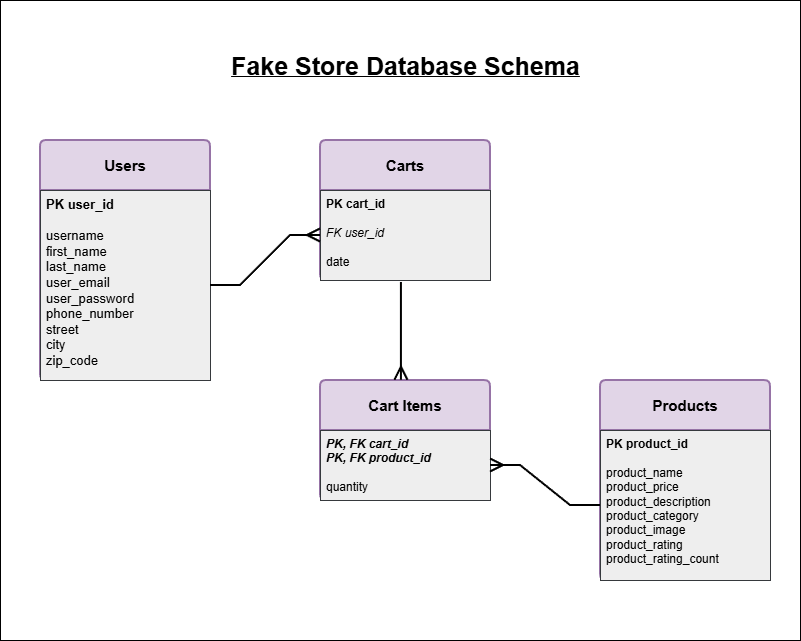
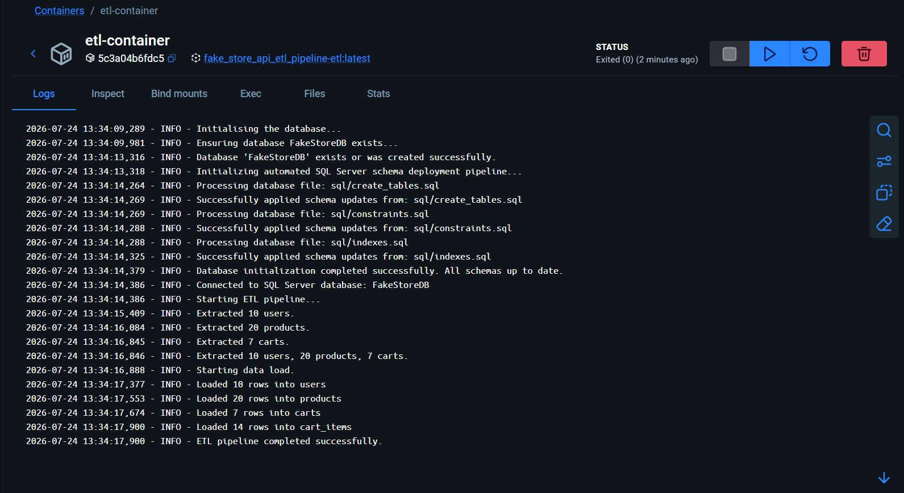
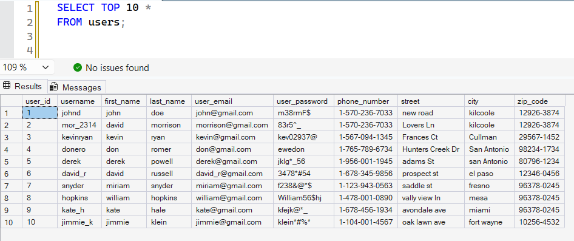
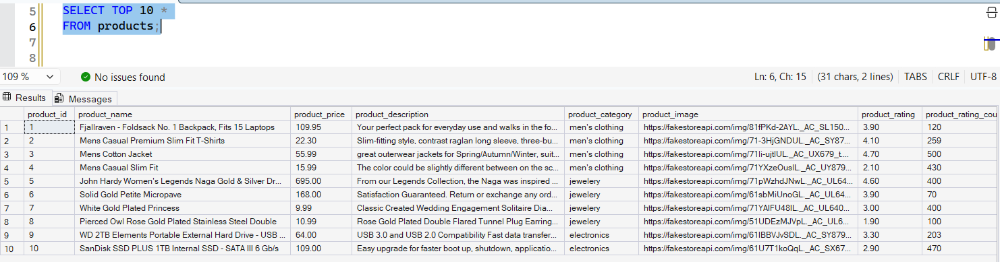
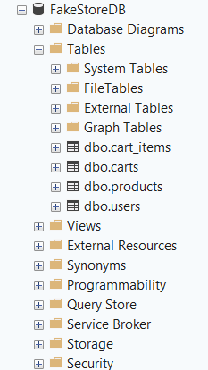

# Fake Store API ETL Pipeline


A Dockerized ETL (Extract, Transform, Load) pipeline built with **Python**, **pandas**, and **Microsoft SQL Server** that extracts data from the Fake Store API, transforms it into a normalized relational model, and loads it into SQL Server.

Unlike a simple ETL script, this project includes **automated database provisioning**, **schema deployment**, **constraint management**, and **containerized execution**, making it closely resemble a real-world data engineering workflow.

## Features

* Extracts data from the Fake Store API
* Transforms nested JSON into a normalized relational schema
* Loads data into Microsoft SQL Server using SQLAlchemy and pyodbc
* Automatically creates the target database if it does not exist
* Deploys tables, constraints, and indexes from SQL scripts
* Uses idempotent SQL scripts for repeatable deployments
* Fully containerized using Docker Compose
* Environment-variable based configuration using `.env`
* Structured logging throughout the ETL process

---

## Architecture

```text
        +----------------------+
        |   Fake Store API     |
        +----------+-----------+
                   |
              Extract JSON
                   |
                   v
     +-----------------------------+
     |        ETL Container        |
     | Python • pandas • SQLAlchemy|
     +--------------+--------------+
                    |
  Database Initialization & ETL Pipeline
                    |
                    v
     +-----------------------------+
     | SQL Server 2022 Container   |
     |        FakeStoreDB          |
     +-----------------------------+
```

---

## Project Structure

```text
Fake_Store_API_ETL_Pipeline/
│
├── etl/
│   ├── extract.py          # Extract data from the Fake Store API
│   ├── transform.py        # Transform API responses into relational tables
│   ├── load.py             # Load data into SQL Server
│   ├── db_init.py          # Database creation and schema deployment
│   └── __init__.py
│
├── sql/
│   ├── create_tables.sql   # Table definitions
│   ├── constraints.sql     # Primary and foreign keys
│   └── indexes.sql         # Database indexes
│
├── screenshots/
│
├── .env.example
├── .gitignore
├── .dockerignore
├── docker-compose.yml
├── Dockerfile
├── requirements.txt
├── main.py
└── README.md
```
---

## Technologies Used

| Category              | Technologies                |
| --------------------- | -------------------------   |
| Languages             | Python 3, SQL               |
| Data Processing       | pandas                      |
| Database              | Microsoft SQL Server 2022   |
| ORM / Database Access | SQLAlchemy, pyodbc          |
| Containerization      | Docker, Docker Compose      |
| API                   | Fake Store API (RESTful API)|
| Configuration         | python-dotenv               |
| ER Diagram            | draw.io                     |

---

## Data Source

This project uses the public **Fake Store API**:

https://fakestoreapi.com/

---

## Database Schema



---

## ETL Workflow

1. Extract data from the Fake Store API.
2. Transform nested JSON into normalized relational tables.
3. Initialize the SQL Server database.
4. Create the database if it does not already exist.
5. Execute SQL scripts to deploy:
   * Tables
   * Constraints
   * Indexes
6. Load transformed data into SQL Server.
7. Log every stage of the pipeline.

---

## Database Initialization

Before loading any data, the pipeline automatically prepares the SQL Server environment.

The initialization process:

* Connects to the `master` database.
* Creates `FakeStoreDB` if it does not already exist.
* Executes SQL scripts from the `sql/` directory.
* Deploys tables.
* Applies primary and foreign key constraints.
* Creates indexes.
* Starts the ETL pipeline only after the database schema is ready.

This approach separates **schema management** from **data loading**, making deployments repeatable and easier to maintain.

---

## Data Transformations

### Users

- Renamed columns
- Flattened nested name and address objects
- Converted data types

### Products

- Renamed columns
- Flattened rating object
- Converted price to numeric
- Converted rating values to numeric

### Carts

- Renamed columns
- Converted date to datetime
- Created separate `carts` table

### Cart Items

- Exploded nested product list
- Normalized product dictionaries
- Created relational mapping between carts and products

---

## Getting Started

### 1. Clone the repository

```bash
git clone https://github.com/rupal13g/Fake_Store_API_ETL_Pipeline

cd Fake_Store_API_ETL_Pipeline
```

### 2. Create the environment file

Copy:

```text
.env.example
```

to

```text
.env
```

Then configure your SQL Server credentials.

---

### 3. Build the containers

```bash
docker compose build
```

---

### 4. Start the application

```bash
docker compose up
```

The ETL container will automatically:

* initialize the database,
* deploy the schema,
* load the data,
* and exit after successful execution.

---

## Example Log Output

```text
Initialising the database...

Ensuring database FakeStoreDB exists...

Processing database file: sql/create_tables.sql

Successfully applied schema updates.

Processing database file: sql/constraints.sql

Successfully applied schema updates.

Processing database file: sql/indexes.sql

Successfully applied schema updates.

Database deployment pipeline completed successfully.

Starting ETL pipeline...

Loaded 10 rows into users

Loaded 20 rows into products

Loaded 7 rows into carts

Loaded 14 rows into cart_items

ETL pipeline completed successfully.
```

---

## Screenshots

Screenshots demonstrating the pipeline execution and SQL Server database are available in the `screenshots/` directory.

### Successful Pipeline Execution



### SQL Server Tables




### Database Tables



---

## Sample SQL Queries

### Total value of each cart

```sql
SELECT
    c.cart_id,
    SUM(ci.quantity * p.product_price) AS total_value
FROM carts c
JOIN cart_items ci
    ON c.cart_id = ci.cart_id
JOIN products p
    ON ci.product_id = p.product_id
GROUP BY c.cart_id;
```

### Most purchased products

```sql
SELECT
    p.product_name,
    SUM(ci.quantity) AS quantity_sold
FROM cart_items ci
JOIN products p
    ON ci.product_id = p.product_id
GROUP BY p.product_name
ORDER BY quantity_sold DESC;
```

---

## What This Project Demonstrates

This project demonstrates practical data engineering concepts including:

* ETL pipeline development
* REST API integration
* Data transformation using pandas
* SQL Server database design
* Schema versioning through SQL scripts
* Database initialization automation
* Docker containerization
* Environment-based configuration
* Structured application logging

---

## Future Improvements

* Implement incremental data loading.
* Schedule the pipeline using Apache Airflow.
* Add data quality validation before loading.
* Introduce unit and integration tests.
* Automate CI/CD using GitHub Actions.
* Deploy the pipeline on Microsoft Azure.
* Replace the source API with cloud object storage (Azure Blob Storage).
* Add pipeline monitoring and alerting.

---

## License

This project is intended for learning and portfolio purposes.

---

## Author

Rupal Gupta

LinkedIn: <a href="https://www.linkedin.com/in/rupal-gupta-10770617a">LinkedIn</a>

Email: <a href="mailto:rupalgupta024@gmail.com">Email</a>