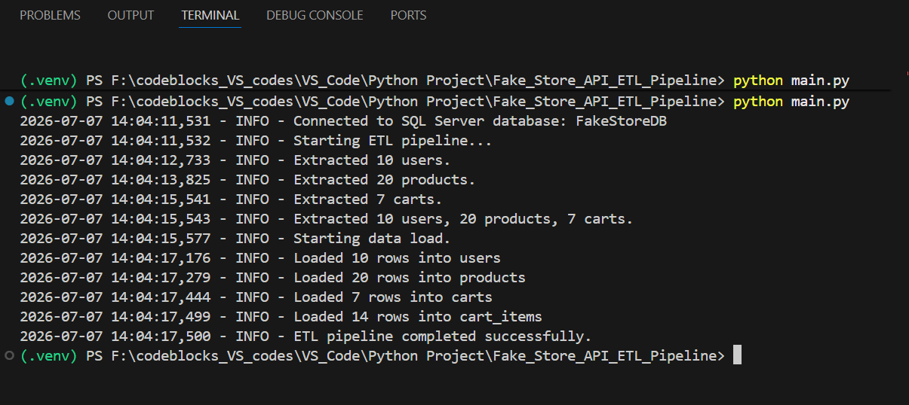

# Fake Store API ETL Pipeline


A Python-based ETL pipeline that extracts data from the Fake Store API, transforms nested JSON into a relational schema, and loads the processed data into Microsoft SQL Server.

## Architecture

```text
Fake Store API
      │
      ▼
   Extract
      │
      ▼
  Transform
      │
      ▼
  SQL Server
```
---

## Features

- Extracts data from Fake Store API
- Transforms nested JSON into relational tables
- Loads data into Microsoft SQL Server
- Implements primary keys, foreign keys, indexes and constraints
- Modular ETL architecture
- Environment variable configuration
- Logging and exception handling

This project demonstrates an end-to-end ETL pipeline built using Python and Pandas.

Data is extracted from the Fake Store API, transformed into a normalized relational schema using Pandas, and loaded into Microsoft SQL Server using SQLAlchemy.

The project follows a modular ETL architecture and includes logging, database constraints, indexes, and environment-based configuration.

The pipeline performs the following steps:

1. **Extract**
   - Fetches data from the Fake Store API.
   - Retrieves:
     - Users
     - Products
     - Carts

2. **Transform**
   - Cleans and renames columns.
   - Converts data types.
   - Flattens nested JSON structures.
   - Splits cart data into relational tables.

3. **Load**
   - Loads the transformed data into Microsoft SQL Server.

---

## Technologies Used

- Python 3.x
- Pandas
- SQLAlchemy
- Requests
- Python-dotenv
- PyODBC
- Microsoft SQL Server
- Draw.io (ER Diagram)

---

## Data Source

This project uses the public **Fake Store API**:

https://fakestoreapi.com/

---

## Database Schema


---

## ETL Workflow

```text
      Fake Store API
            │
            │
            ▼
Extract Data (JSON Response)
            │
            |
            ▼
     Transform Data
    - Clean columns
    - Rename fields
    - Normalize nested JSON
    - Convert data types
            │
            |
            ▼
    Load into SQL Server
            │
            |
            ▼
 Relational Database Tables
```

---

## Project Structure

```text
Fake_Store_API_ETL_Pipeline/
│
├── etl/
│   ├── extract.py
│   ├── transform.py
│   ├── load.py
│   └── __init__.py
│
├── sql/
│   ├── create_tables.sql
│   ├── constraints.sql
│   └── indexes.sql
│
├── screenshots/
│
├── .env.example
├── requirements.txt
├── main.py
└── README.md
```

---

## Screenshots

### Successful Pipeline Execution



### SQL Server Tables


### Database Tables


---

## Data Transformations

### Users

- Renamed columns
- Flattened nested name and address objects
- Converted data types

### Products

- Renamed columns
- Flattened rating object
- Converted price to numeric
- Converted rating values to numeric

### Carts

- Renamed columns
- Converted date to datetime
- Created separate `carts` table

### Cart Items

- Exploded nested product list
- Normalized product dictionaries
- Created relational mapping between carts and products

---

## How to Run

1. Clone the repository

```bash
git clone https://github.com/rupal13g/Fake_Store_API_ETL_Pipeline/
```
2. Create a virtual environment

```bash
python -m venv .venv
```

3. Activate (in Windows)

```powershell
.venv\Scripts\activate
```

4. Install dependencies

```bash
pip install -r requirements.txt
```

5. Create a `.env` file using `.env.example`.

```text
DB_SERVER=
DB_DATABASE=
DB_DRIVER=
```

6. Run SQL scripts

```text
1. create_tables.sql

2. constraints.sql

3. indexes.sql
```

7. Run the pipeline

```bash
python main.py
```

---

## Sample SQL Queries

### Total value of each cart

```sql
SELECT
    c.cart_id,
    SUM(ci.quantity * p.product_price) AS total_value
FROM carts c
JOIN cart_items ci
    ON c.cart_id = ci.cart_id
JOIN products p
    ON ci.product_id = p.product_id
GROUP BY c.cart_id;
```

### Most purchased products

```sql
SELECT
    p.product_name,
    SUM(ci.quantity) AS quantity_sold
FROM cart_items ci
JOIN products p
    ON ci.product_id = p.product_id
GROUP BY p.product_name
ORDER BY quantity_sold DESC;
```

---

## Logging

```text
2026-07-07 14:04:11,531 - INFO - Connected to SQL Server database: FakeStoreDB
2026-07-07 14:04:11,532 - INFO - Starting ETL pipeline...
2026-07-07 14:04:12,733 - INFO - Extracted 10 users.
2026-07-07 14:04:13,825 - INFO - Extracted 20 products.
2026-07-07 14:04:15,541 - INFO - Extracted 7 carts.
2026-07-07 14:04:15,543 - INFO - Extracted 10 users, 20 products, 7 carts.
2026-07-07 14:04:15,577 - INFO - Starting data load.
2026-07-07 14:04:17,176 - INFO - Loaded 10 rows into users
2026-07-07 14:04:17,279 - INFO - Loaded 20 rows into products
2026-07-07 14:04:17,444 - INFO - Loaded 7 rows into carts
2026-07-07 14:04:17,499 - INFO - Loaded 14 rows into cart_items
2026-07-07 14:04:17,500 - INFO - ETL pipeline completed successfully.
```

---

## Future Improvements

- Add incremental loading instead of full loads.
- Implement automated table creation from Python.
- Add unit tests for transformation functions.
- Containerize the project using Docker.
- Orchestrate the pipeline using Apache Airflow.
- Deploy the pipeline on Azure.
- Integrate CI/CD using GitHub Actions.

---

## Key Learnings

This project helped me strengthen my understanding of:

- Designing modular ETL pipelines
- Working with REST APIs
- Transforming nested JSON into relational tables
- Database schema design
- SQL Server constraints and indexing
- SQLAlchemy and Pandas integration
- Logging and exception handling
- Environment variable management

## Author

Rupal Gupta

LinkedIn: <a href="https://www.linkedin.com/in/rupal-gupta-10770617a">LinkedIn</a>

Email: <a href="mailto:rupalgupta024@gmail.com">Email</a>